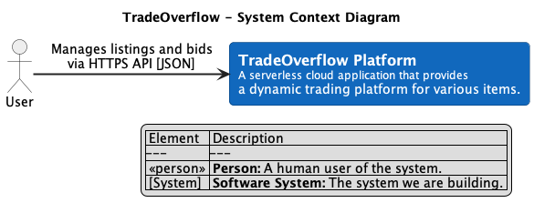
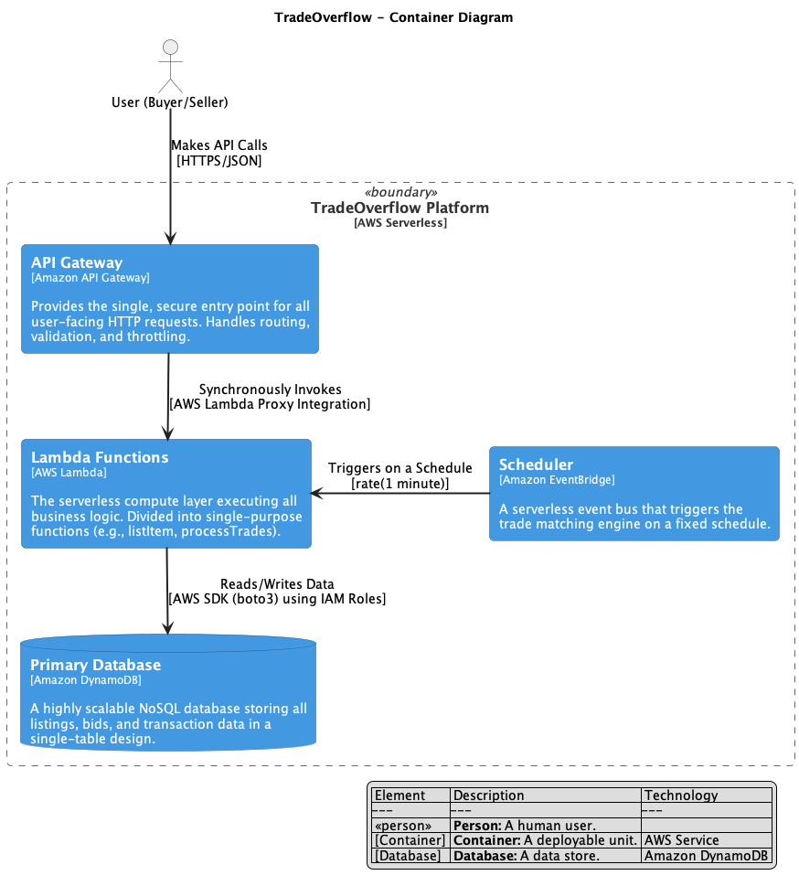
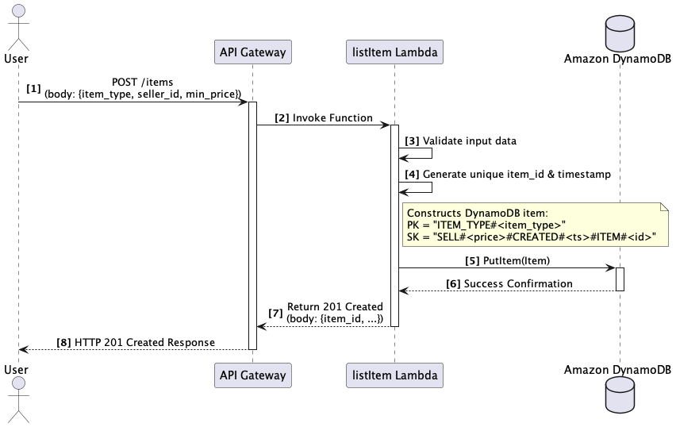
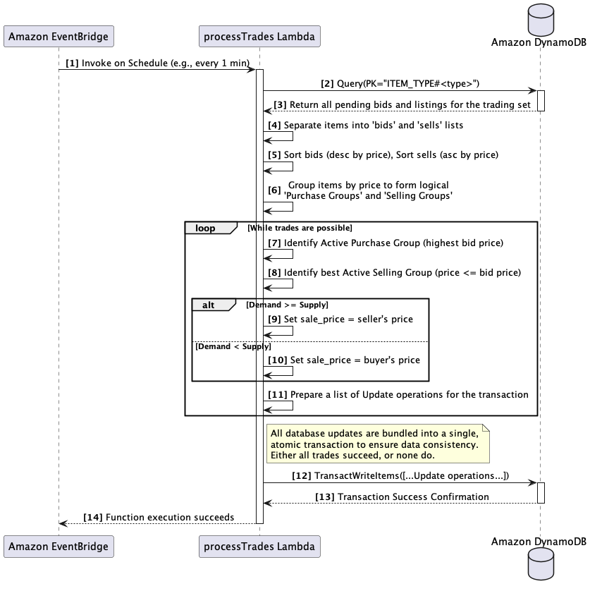
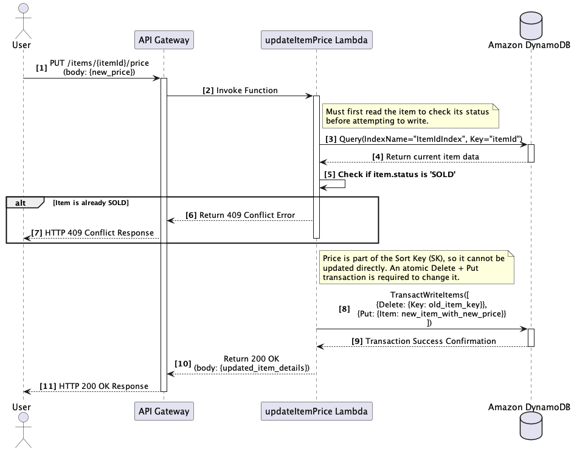

# TradeOverflow System Architecture Design Report

**Author**: Hang Zhou
**Date**: August 5, 2025  

---

## 1. System Overview

TradeOverflow aims to revolutionize the traditional online auction model by offering a more dynamic and efficient trading platform. Unlike conventional auctions with fixed end times, this system adopts a continuous trading model designed to facilitate the rapid circulation of goods.

The core mechanism of the system is to automatically aggregate all items of the same type into a "trading pool." Within this pool, sellers can list items and specify their minimum acceptable prices at any time, while buyers may submit purchase offers indicating their maximum willingness to pay. The system’s background matching engine continuously scans these supply-demand signals and executes matches based on a trading strategy that balances buyer-seller interests and incentivizes transactions.

---

## 2. Software Architecture (C4 Model)

This section utilizes the C4 model to describe the TradeOverflow software architecture from high-level to low-level abstraction.

### 2.1 C4 - Level 1: System Context Diagram

**Diagram**:  

**Description**:

At the highest abstraction level, TradeOverflow is considered a standalone software system. It interacts with a single external actor: the *User*, who may act as a *Seller* (listing items) or a *Buyer* (submitting bids). All users interact with the platform through a unified and secure HTTPS API to manage their listings and offers.

---

### 2.2 C4 - Level 2: Container Diagram

**Diagram**:  

**Description**:

The internal architecture is composed of four primary logical containers, all built on AWS serverless services to ensure high availability, scalability, and maintainability:

- **Amazon API Gateway (System Entry Point)**: Serves as the “front door” of the system and handles all external HTTP requests. It validates requests based on the `openapi.yaml` specification and securely routes valid requests to the appropriate AWS Lambda functions.

- **AWS Lambda Functions (Business Logic)**: The “brain” of the system, executing all business logic. Each Lambda function is a microservice (e.g., `listItem`, `submitBid`, `processTrades`) dedicated to a single operation. This separation decouples user-facing API actions from the backend trade matching logic.

- **Amazon DynamoDB (Data Store)**: The system’s “memory” and primary database. DynamoDB was chosen for its ability to deliver stable, millisecond-level performance under high loads. A carefully designed single-table model using partition keys (PK) and sort keys (SK) supports efficient storage and querying of various data types including items and bids.

- **Amazon EventBridge (Scheduler)**: The system’s “heartbeat,” acting as a serverless scheduler. A rule is configured to reliably trigger the `processTrades` function at fixed intervals (e.g., every minute), fulfilling the system's continuous matching requirement without needing dedicated servers.

---

### 2.3 C4 - Level 4: Code-Level Diagrams

Below are UML sequence diagrams for the three core functional features specified in the assignment.

#### Feature 1: Add a New Item Listing

**Diagram**:  

**Description**:

1. The user sends a POST `/items` request to the API Gateway with item details.
2. After validation, the API Gateway invokes the `listItem` Lambda function.
3. The function validates the input, generates a unique `item_id`, and timestamps the entry.
4. It constructs a DynamoDB item using a PK for item type aggregation and SK with price and timestamp for efficient sorting.
5. A `PutItem` operation writes the entry to the DynamoDB table.
6. Upon success, a `201 Created` response is returned, containing the full item information.

#### Feature 2: Execute Trade (More Buyers than Sellers)

**Diagram**:  

**Description**:

1. Amazon EventBridge triggers the `processTrades` Lambda function on a scheduled basis.
2. The function queries DynamoDB for all items and bids under a specific item type.
3. It sorts and groups results in memory to identify active buyer and seller pools, then determines matched pairs and trade prices using a "buyer-heavy" strategy.
4. It builds a transactional list of `Update` operations, marking items as SOLD and bids as SUCCESSFUL, and recording the trade price and timestamp.
5. A `TransactWriteItems` call submits the transaction, ensuring atomicity and consistency.
6. The transaction either commits all updates or none, guaranteeing a consistent trade state.

#### Feature 3: Seller Modifies Item Price

**Diagram**:  

**Description**:

1. The user sends a PUT `/items/{itemId}/price` request with the new price.
2. API Gateway triggers the `updateItemPrice` Lambda function.
3. The function queries DynamoDB using the `ItemIdIndex` secondary index to fetch the item’s current status.
4. If the item is already SOLD, a `409 Conflict` response is returned.
5. Because the price is part of the sort key, the function constructs an atomic transaction consisting of a `Delete` (old price) and a `Put` (new price).
6. A `TransactWriteItems` call performs the atomic update.
7. Upon success, a `200 OK` response is returned.

---

## 3. Architectural Justification

This architecture is designed to fully meet the three non-functional requirements outlined in the assignment.

### 3.1 Availability

By relying entirely on AWS-managed serverless services—API Gateway, Lambda, DynamoDB, and EventBridge—the system inherits high availability by default. These services are redundantly deployed across multiple Availability Zones (AZs), and offer SLAs of up to 99.99%, ensuring seamless operation even in the face of hardware failures.

### 3.2 Scalability

This design is built to handle massive fluctuations in traffic:

- **Compute Layer**: AWS Lambda’s concurrency model allows the system to scale out to thousands of function instances within milliseconds, with no pre-provisioning required.
- **Database Layer**: DynamoDB operates in on-demand mode, automatically scaling read/write capacity based on load, delivering consistent low-latency performance regardless of traffic surges (e.g., Cyber Monday).
- **Cost-Efficiency**: The architecture is pay-as-you-go. When traffic is low, costs are near-zero. When demand spikes, users only pay for actual compute time and database operations, achieving cost-effective scalability.

### 3.3 Maintainability

- **Modularity & Decoupling**: Each Lambda function is a self-contained microservice, allowing teams to modify or deploy features (e.g., `submitBid`) independently without affecting others like `listItem` or the trade engine.
- **Infrastructure as Code (IaC)**: All AWS resources are declared in a `main.tf` file. Changes to infrastructure (e.g., adding an index or deploying a feature) are version-controlled, auditable, and reproducible.
- **Clear API Contracts**: The `openapi.yaml` file defines strict and unambiguous API contracts. This supports both automated deployment and future client or integration development.

---

## 4. Security Analysis

**Attack Surface**: The system’s primary attack vector is the publicly exposed API Gateway endpoints.

**Risks and Mitigations**:

- **DDoS Attacks**: API Gateway is natively integrated with AWS Shield Standard, which provides automatic protection against common Layer 7 DDoS threats at no additional cost.
- **Unauthorized Access**: Although user authentication is not implemented in this prototype, API Gateway supports robust authorization mechanisms. In production, JWT authorizers (e.g., Auth0 or AWS Cognito) can be easily integrated to restrict access to authenticated users only.
- **Injection Attacks**: All database interactions use parameterized calls via the boto3 SDK. This approach prevents NoSQL injection vulnerabilities by design.
- **Over-privileged Roles**: The principle of least privilege is strictly enforced. Each Lambda function is assigned an IAM role with scoped permissions—only allowing read/write access to the specific `tradeoverflow` DynamoDB table, minimizing blast radius in case of credential leaks.

---

# References

1. S. Brown, "The C4 model for visualising software architecture." [Online]. Available: https://c4model.com/. [Accessed: Aug. 6, 2025].

2. Baird, A., Huang, G., Munns, C., & Weinstein, O. (2017). Serverless architectures with aws lambda. Amazon Web Services.

3. J. Lewis and M. Fowler, "Microservices," martinfowler.com, Mar. 25, 2014. [Online]. Available: https://martinfowler.com/articles/microservices.html. [Accessed: Aug. 6, 2025].

4. DeBrie, A. (2020). The dynamodb book. Independently published.

5. R. Houlihan, "AWS re:Invent 2018: Amazon DynamoDB Deep Dive: Advanced Design Patterns for DynamoDB (DAT401)," presented at the AWS re:Invent, Las Vegas, NV, USA, Nov. 2018. [Online]. Available: https://www.youtube.com/watch?v=HaEPXoXVf2k [Accessed: Aug. 6, 2025].

6. Morris, K. (2016). Infrastructure as code: managing servers in the cloud. " O'Reilly Media, Inc.".
